Creación de Repos 1  
Crearlo en GitHub, clonarlo localmente y subir cambios  

  
  
  
  
  
  
  
  
  

Creación de Repos 2  
Crearlo localmente y subirlo a GitHub  
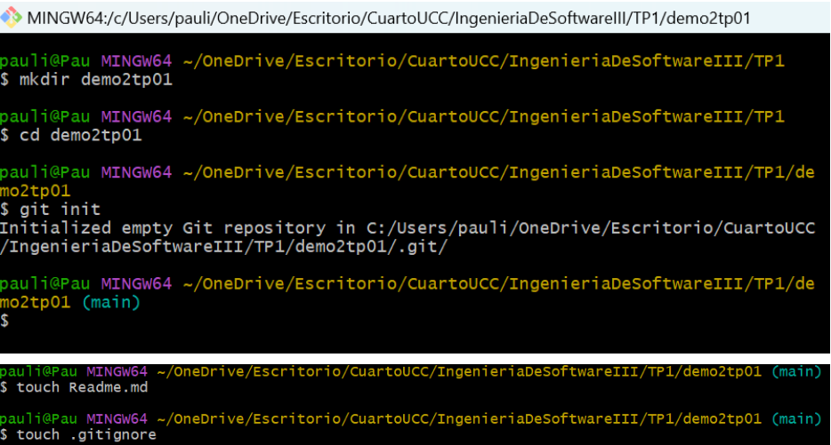  
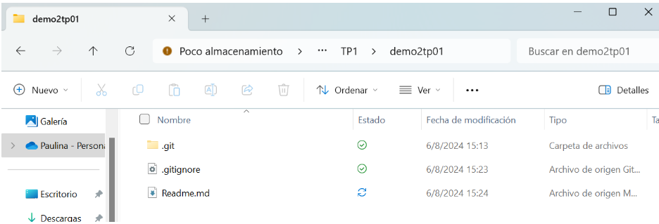 
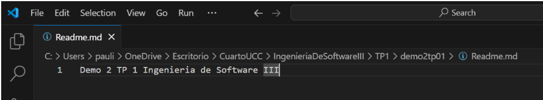 
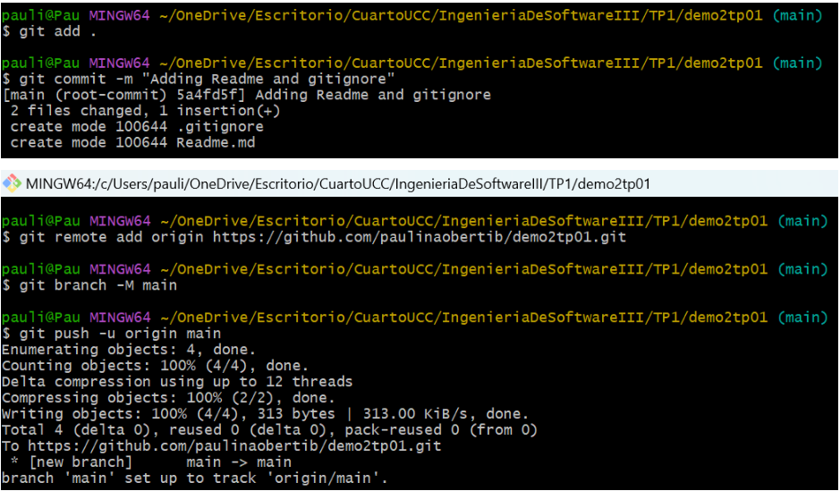 
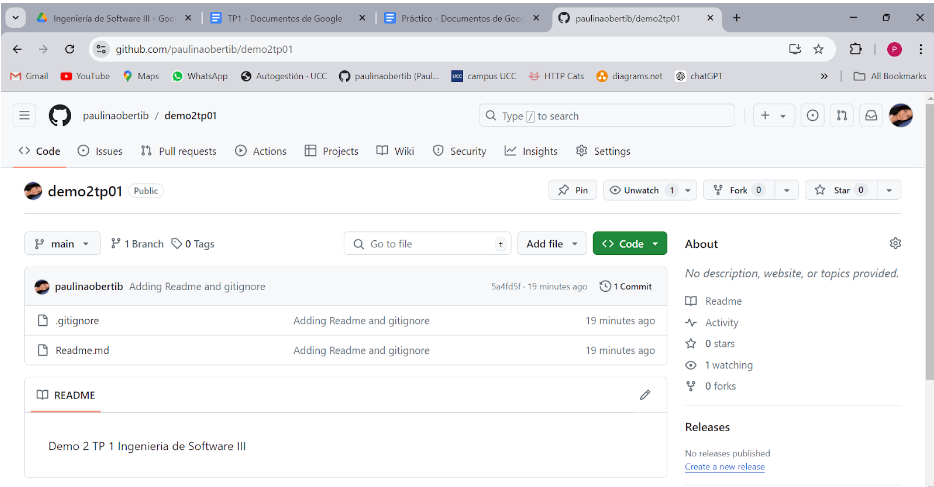
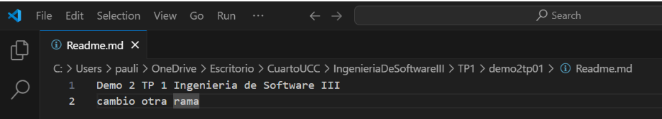
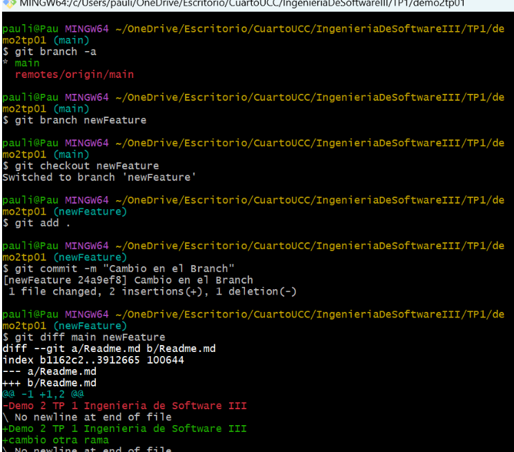

Rama  
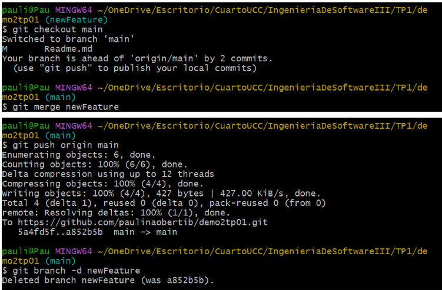 
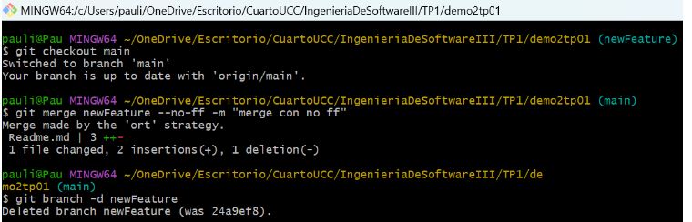

Merge

- Fast-Forward Merge

- No Fast-Forward Merge

Pull Request  
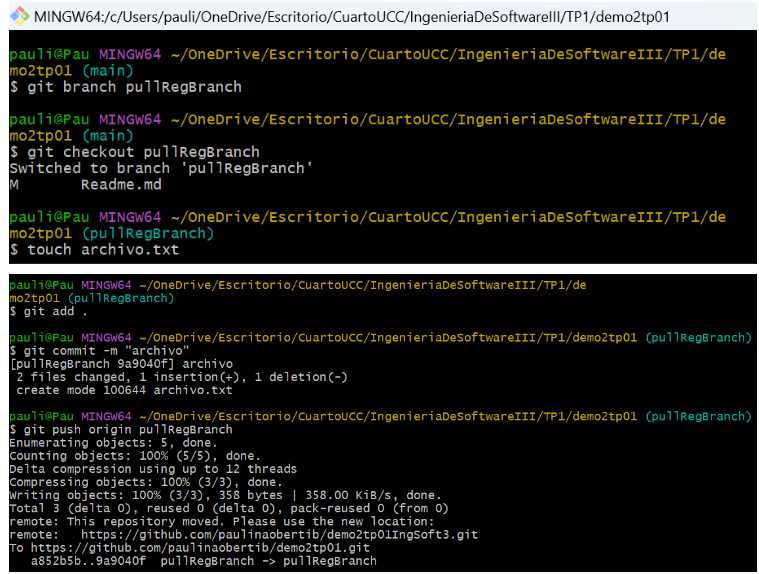
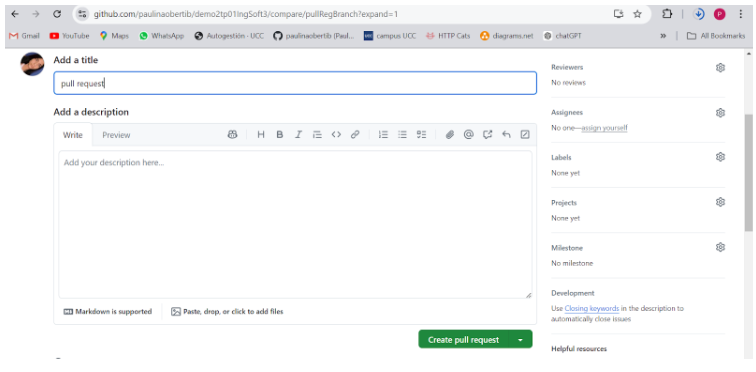
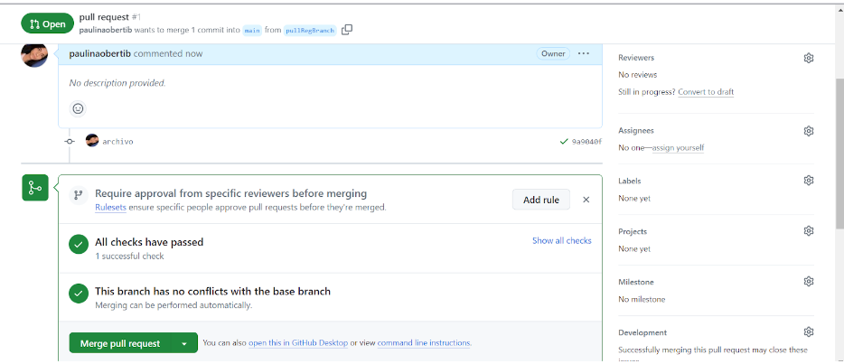
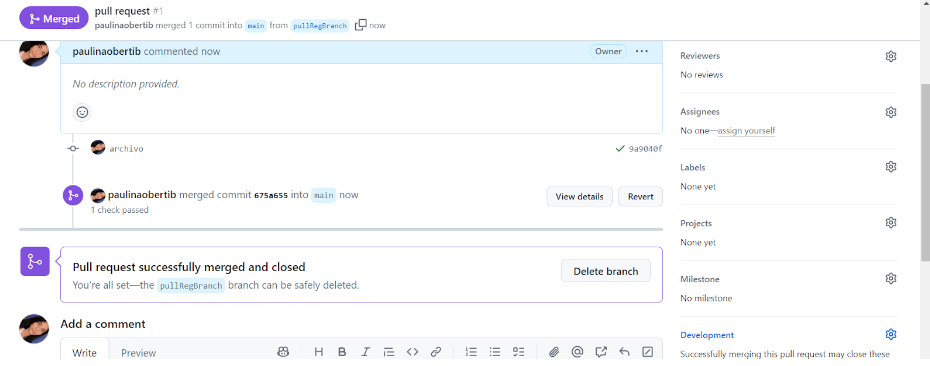
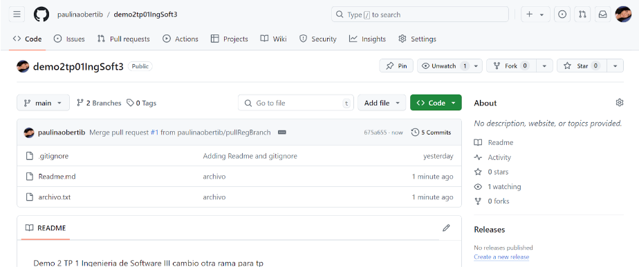
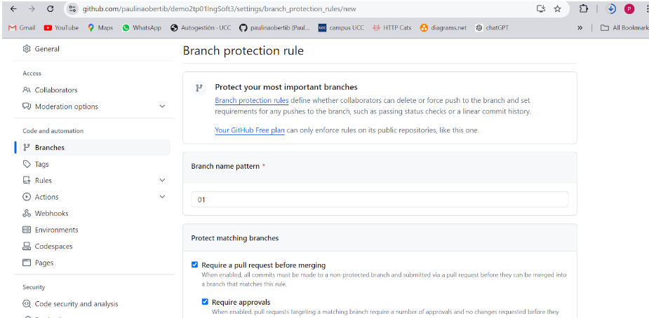
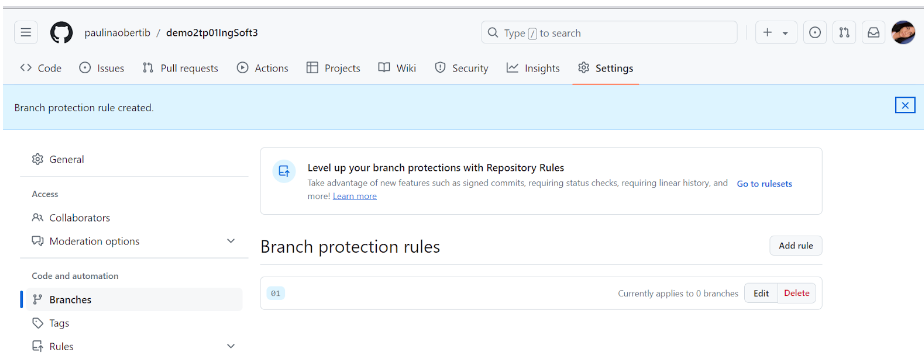

Resolución de Conflictos  
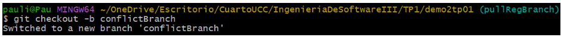
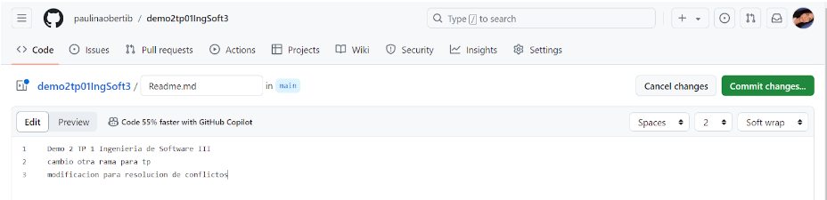
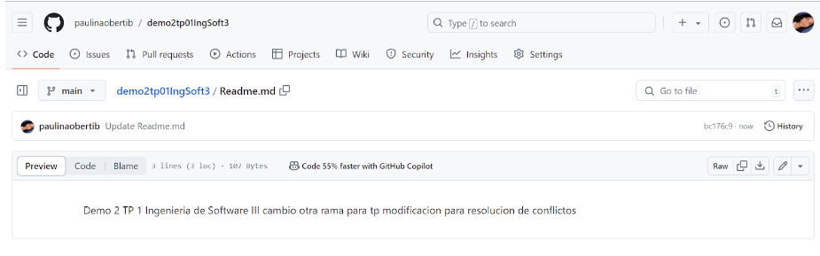
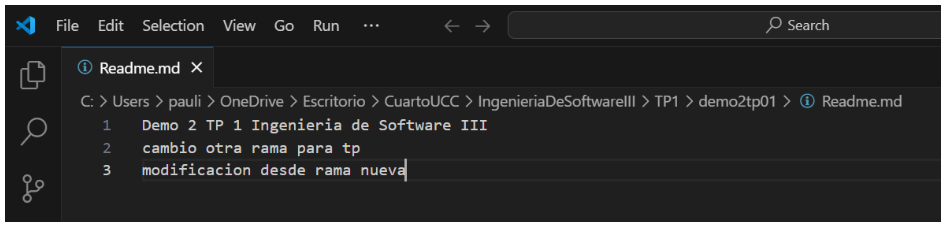
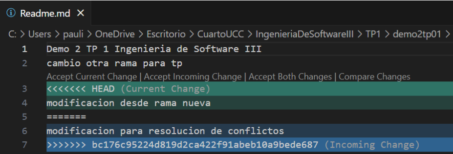
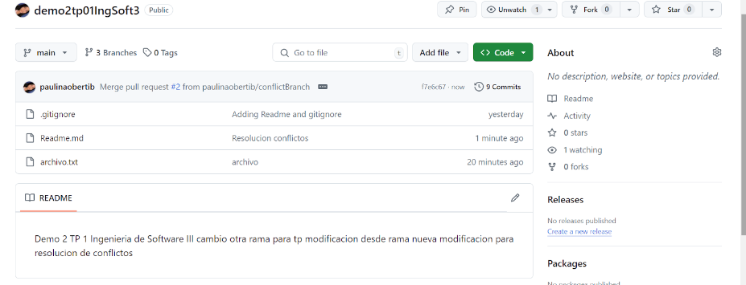
