- Docker Hub
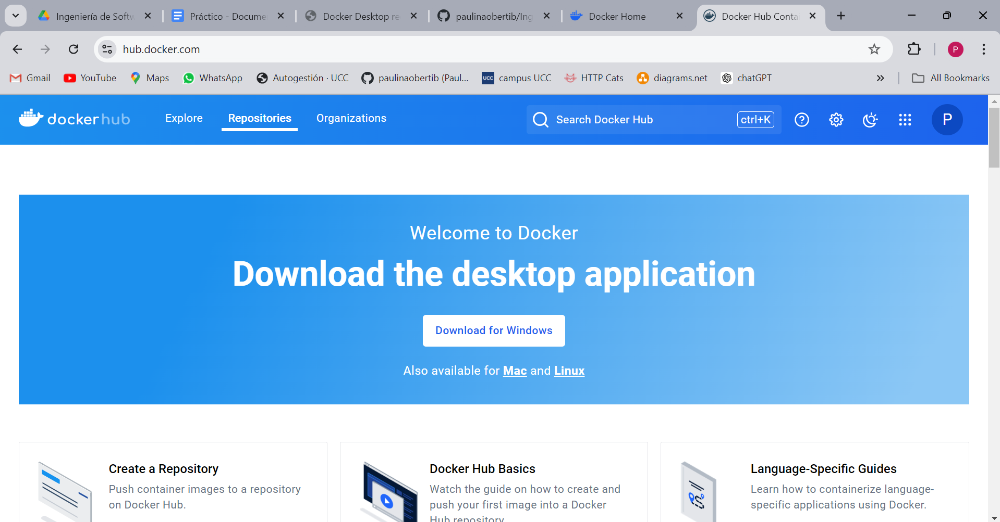
- Docker version
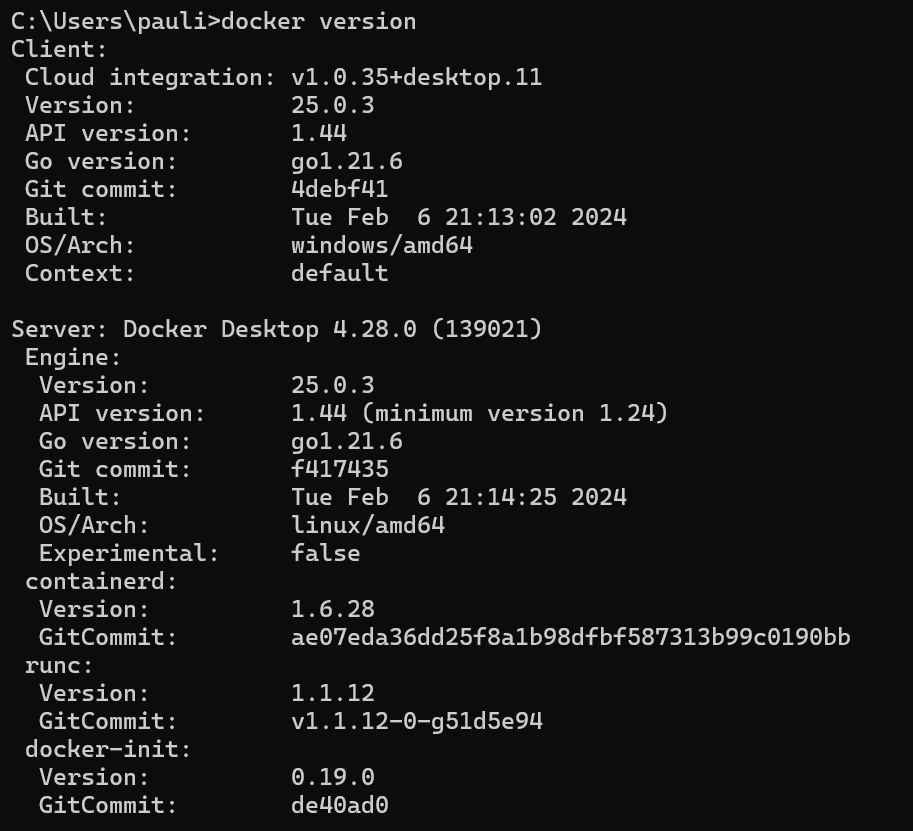
- BusyBox
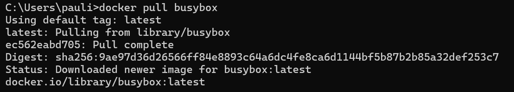

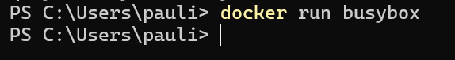
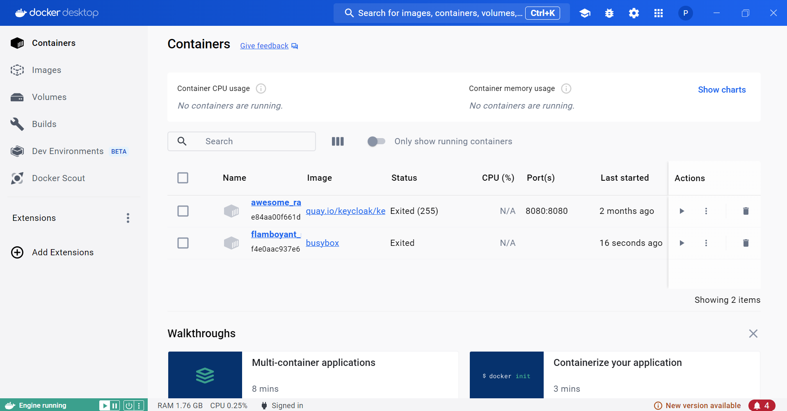

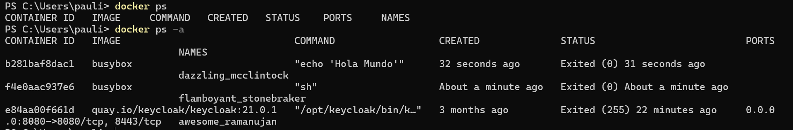
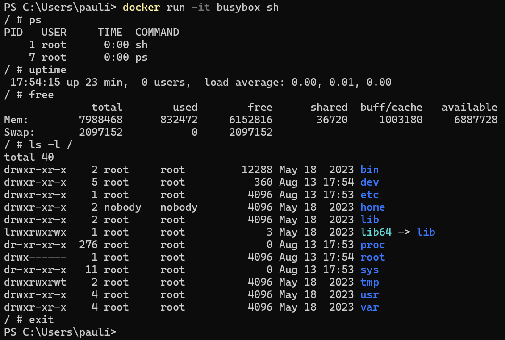
- Eliminar contenedores
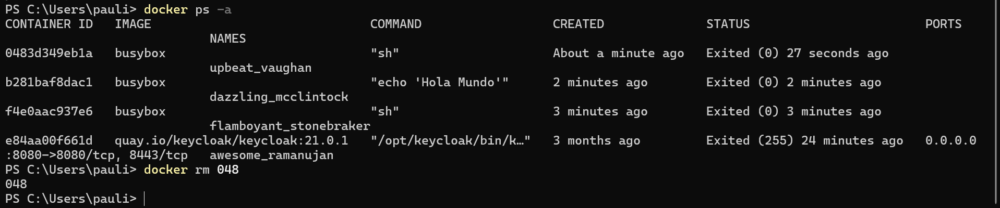
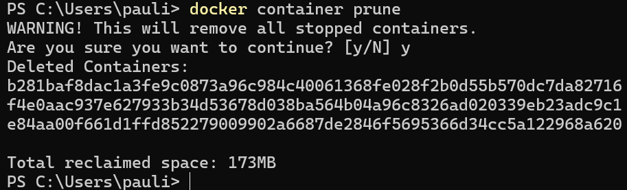
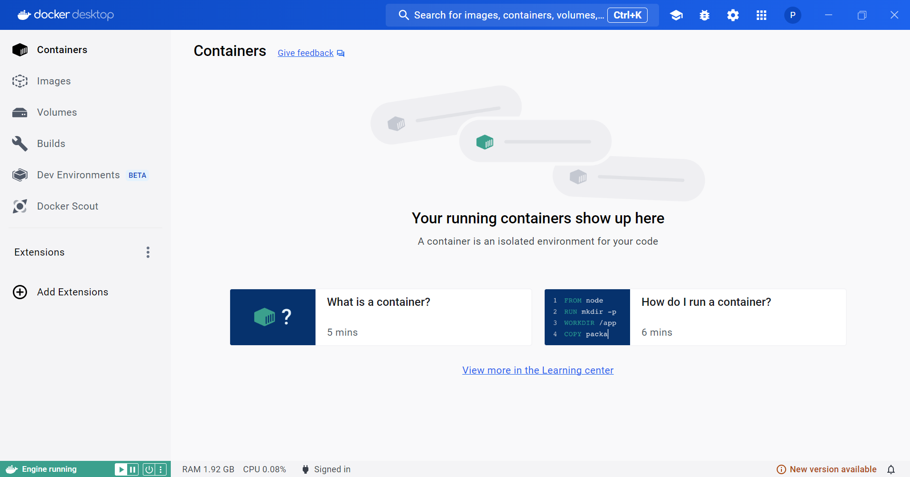
- Construir una imagen (SimpleWebAPI) 
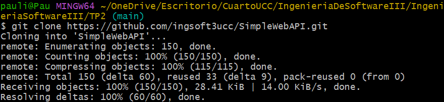
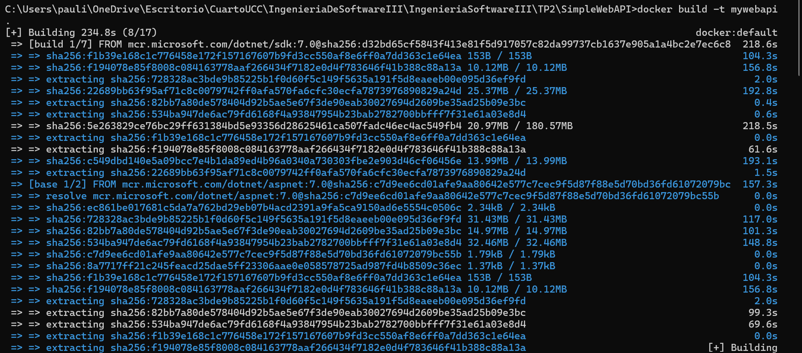
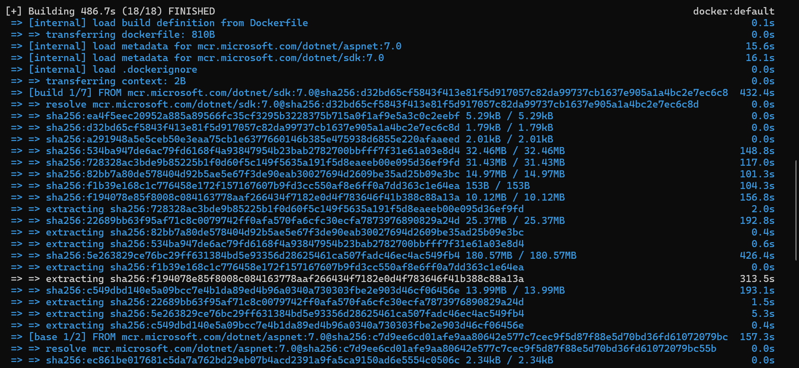
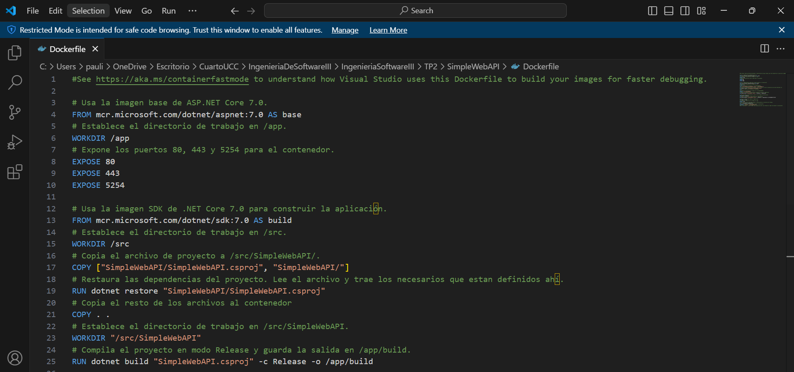
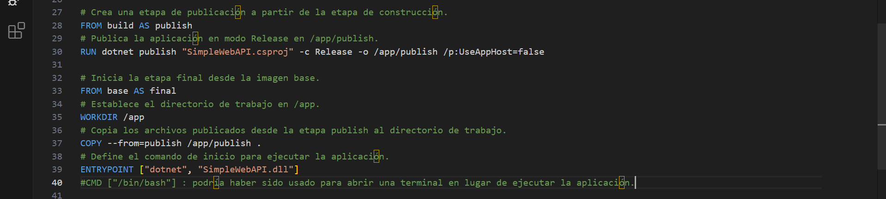
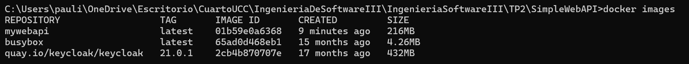
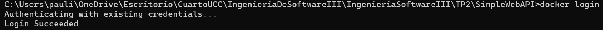
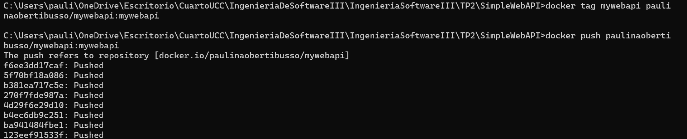

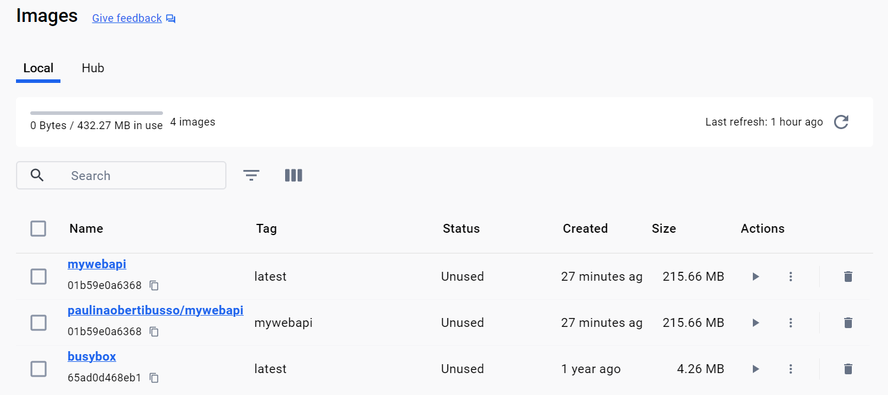
- Puertos
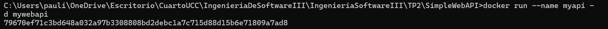
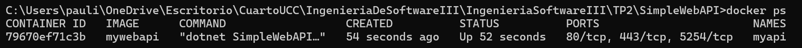
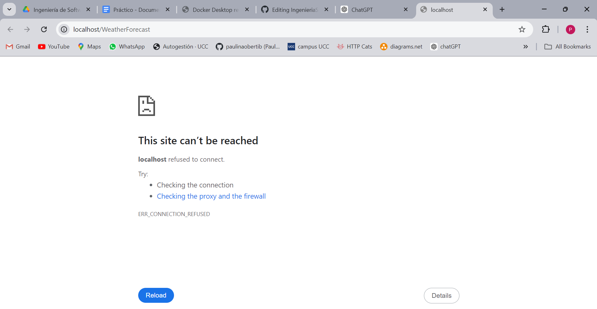
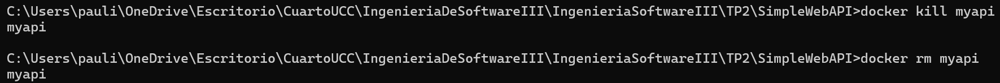
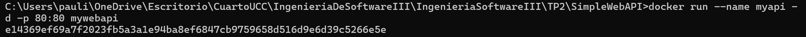
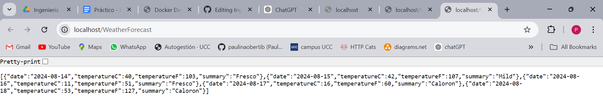
- Modificar DockerFile
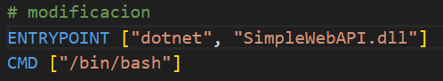
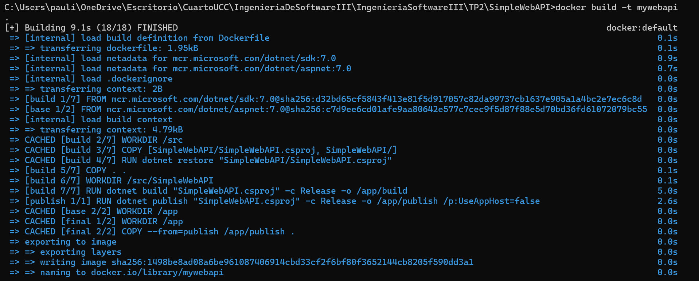

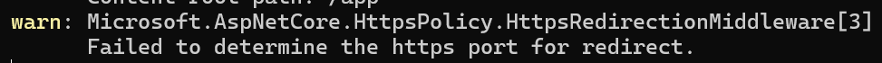
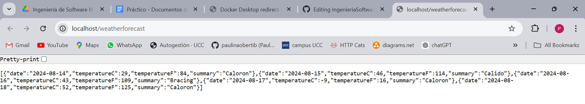
- Volumenes
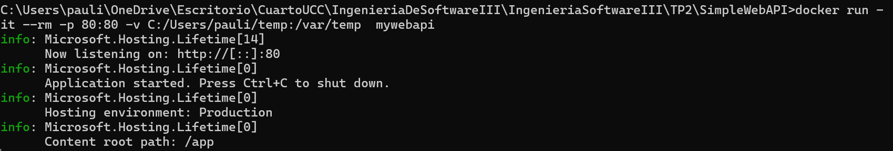
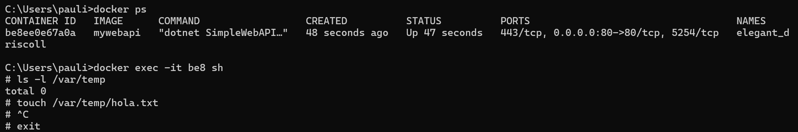
- Base de datos
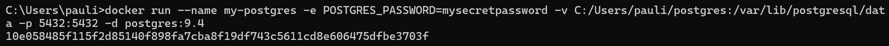
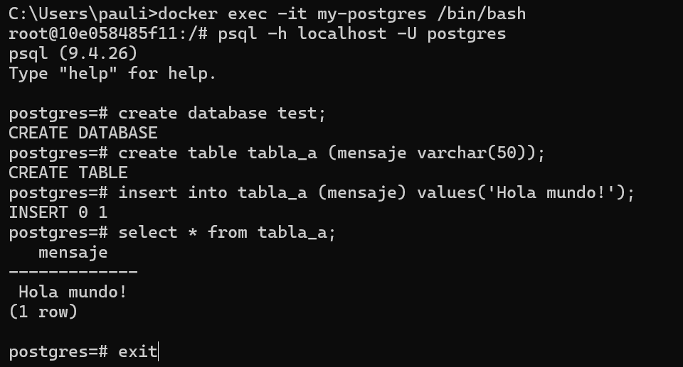
 -docker run: Este comando creó e inició una instancia de PostgreSQL 9.4 en un contenedor Docker. La base de datos está configurada para persistir sus datos en un directorio de la máquina local, y es accesible a través del puerto 5432.
 -docker exec: Este comando da acceso a una terminal interactiva dentro del contenedor de PostgreSQL, permitiendo ejecutar comandos directamente dentro del entorno del contenedor.
- SQL Server
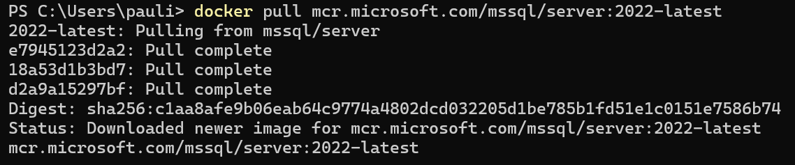
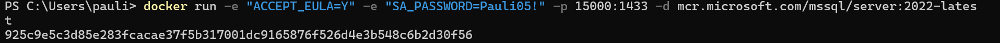
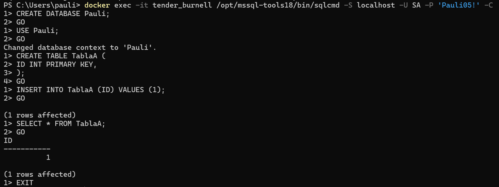
