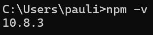

Prerequisitos:
node

npm

angular

.NET Core 8

4.1 Creación de una BD SQL Server para nuestra App

4.2 Obtener nuestra App

4.3 Crear Pruebas Unitarias para nuestra API

Modificacion y perdida de acceso a la bd

Modicacion y correcto acceso a la bd

4.4 Creamos pruebas unitarias para nuestro front de Angular

4.5 Agregamos generación de reporte XML de nuestras pruebas de front

4.6 Modificamos el código de nuestra API y creamos nuevas pruebas unitarias
4.7 Modificamos el código de nuestro Front y creamos nuevas pruebas unitarias
