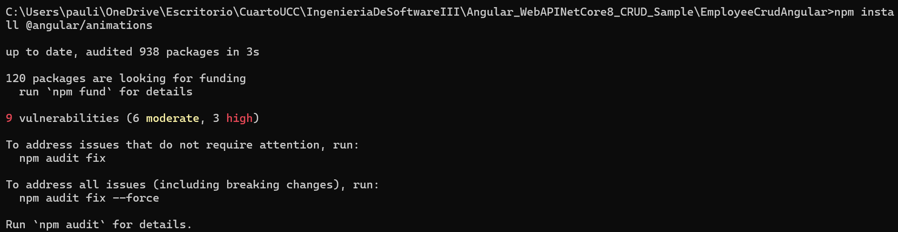

Prerequisitos:
node

npm

angular

.NET Core 8

4.1 Creación de una BD SQL Server para nuestra App

4.2 Obtener nuestra App

4.3 Crear Pruebas Unitarias para nuestra API

Modificacion y perdida de acceso a la bd

Modicacion y correcto acceso a la bd

4.4 Creamos pruebas unitarias para nuestro front de Angular

4.5 Agregamos generación de reporte XML de nuestras pruebas de front

4.6 Modificamos el código de nuestra API y creamos nuevas pruebas unitarias
Modificaciones en el codigo:
- La longitud máxima del nombre y apellido del empleado debe ser de 100 caracteres.

- Validar que el nombre tenga un número mínimo de caracteres, por ejemplo, al menos dos caracteres para evitar entradas inválidas como "A".

- Verificar que el nombre no contenga números, ya que no es común en los nombres de empleados.

- Prohibir el uso de nombres triviales o genéricos como "Empleado", "N/A", "Nombre", etc.

- Evitar que se ingresen caracteres repetidos de forma excesiva, como "Juuuuaannnn".

Pruebas unitarias:
- La longitud máxima del nombre y apellido del empleado debe ser de 100 caracteres.

- Validar que el nombre tenga un número mínimo de caracteres, por ejemplo, al menos dos caracteres para evitar entradas inválidas como "A".

- Verificar que el nombre no contenga números, ya que no es común en los nombres de empleados.

- Prohibir el uso de nombres triviales o genéricos como "Empleado", "N/A", "Nombre", etc.

- Evitar que se ingresen caracteres repetidos de forma excesiva, como "Juuuuaannnn".

Ejecucion:

4.7 Modificamos el código de nuestro Front y creamos nuevas pruebas unitarias
Instalamos la libreria de toast

Modificamos app.config.ts

Creamos toast.css

Agregamos validaciones a addemployee.component.ts
- La longitud máxima del nombre y apellido del empleado debe ser de 100 caracteres.

- Validar que el nombre tenga un número mínimo de caracteres, por ejemplo, al menos dos caracteres para evitar entradas inválidas como "A".

- Verificar que el nombre no contenga números, ya que no es común en los nombres de empleados.

- Prohibir el uso de nombres triviales o genéricos como "Empleado", "N/A", "Nombre", etc.

- Evitar que se ingresen caracteres repetidos de forma excesiva, como "Juuuuaannnn".

Modificamos addemployee.component.spec.ts
- La longitud máxima del nombre y apellido del empleado debe ser de 100 caracteres.

- Validar que el nombre tenga un número mínimo de caracteres, por ejemplo, al menos dos caracteres para evitar entradas inválidas como "A".

- Verificar que el nombre no contenga números, ya que no es común en los nombres de empleados.

- Prohibir el uso de nombres triviales o genéricos como "Empleado", "N/A", "Nombre", etc.

- Evitar que se ingresen caracteres repetidos de forma excesiva, como "Juuuuaannnn".

Realizamos las pruebas

