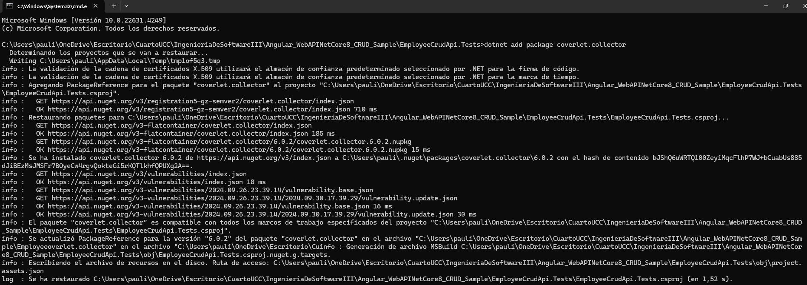
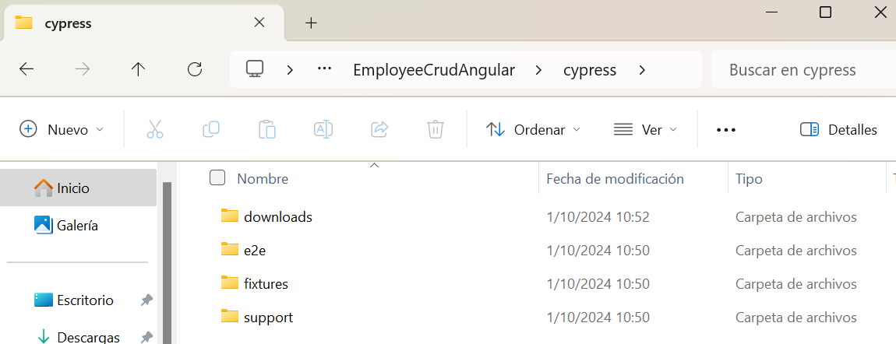
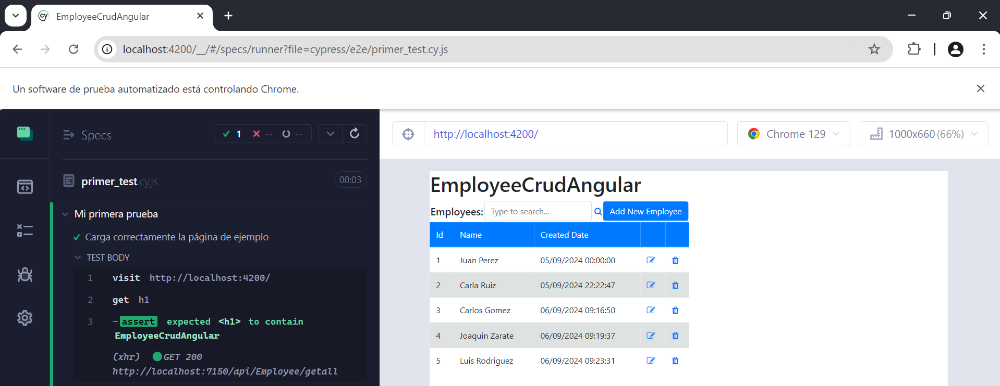
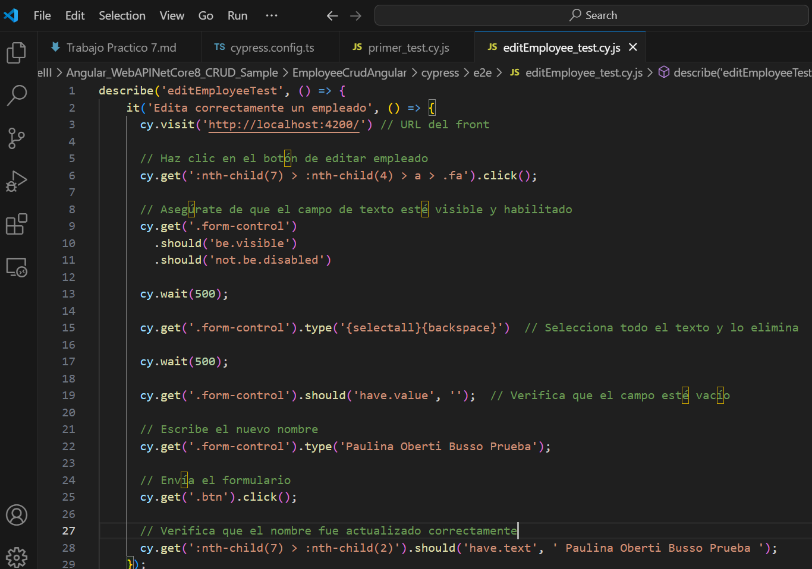
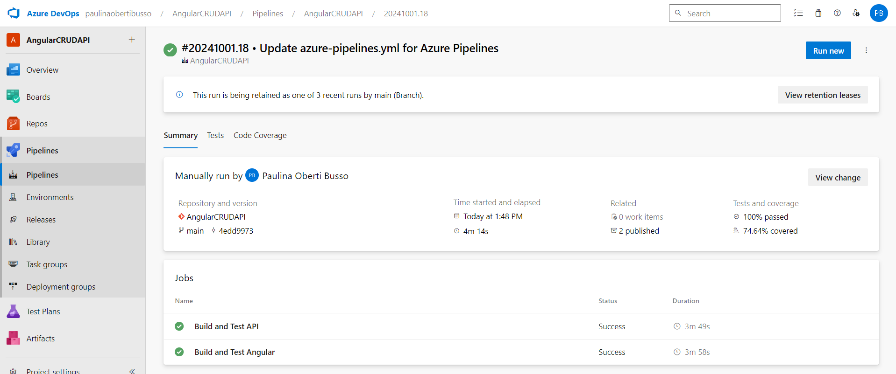

4.1 Agregar Code Coverage a nuestras pruebas unitarias de backend y front-end e integrarlas junto con sus resultados en nuestro pipeline de build.
- 4.1.1 En el directorio raiz de nuestro proyecto Angular instalar el siguiente paquete:

- 4.1.2 Editar nuestro archivo karma.conf.js para que incluya reporte de cobertura:

- 4.1.3 En el dir raiz del proyecto EmployeeCrudApi.Tests ejecutar:

- 4.1.4 Agregar a nuestro pipeline ANTES del Build de Back la tarea de test con los argumentos especificados y la de publicación de resultados de cobertura:

- 4.1.5 Agregar a nuestro pipeline ANTES del Build de front la tarea de test y la de publicación de los resultados:

- 4.1.6 Ejecutar el pipeline y analizar el resultado de las pruebas unitarias y la cobertura de código:

4.2 Agregar Análisis Estático de Código con SonarCloud.

El informe de SonarCloud ha destacado varios aspectos clave para mejorar el proyecto en términos de calidad, seguridad y mantenibilidad. Entre los principales hallazgos se incluyen:
- Code smells: Se detectaron indicios de código que no afectan el funcionamiento inmediato, pero sugieren mejoras para facilitar su comprensión y modificación. Por ejemplo, se recomienda convertir ciertos métodos en estáticos para optimizar el uso de memoria y mejorar la claridad del código.
- Referencias nulas: Se encontraron riesgos de fallos en tiempo de ejecución debido a variables o métodos que pueden ser nulos, lo que requiere una mejor gestión para evitar problemas inesperados en la aplicación.
- Seguridad: El informe señala la presencia de valores sensibles, como contraseñas, incrustados en el código, lo que representa una vulnerabilidad significativa. Se recomienda mover estos valores a entornos más seguros.
- Vulnerabilidades críticas: Se identificaron fallos de seguridad que deben corregirse para evitar posibles ataques que comprometan la estabilidad del sistema y la protección de los datos de los usuarios.
- Prácticas ineficientes: Se observó el uso de técnicas como "RunSync", que puede afectar el rendimiento de la aplicación. Optimizar estos aspectos mejoraría la eficiencia y escalabilidad del código.

4.3 Pruebas de Integración con Cypress.
- 4.3.1 En el directorio raiz de nuestro proyecto Angular instalar el siguiente paquete:

- 4.3.2 Abrir Cypress:

- 4.3.3 Inicializar Cypress en nuestro proyecto:

- 4.3.4 Crear nuestra primera prueba navegando a nuestro front:

- 4.3.5 Correr nuestra primera prueba:

- 4.3.6 Modificar nuestra prueba para que falle:

- 4.3.7 Grabar nuestras pruebas para que Cypress genere código automático y genere reportes:

- 4.3.8 Hacemos prueba de editar un empleado:

4.4 Desafios.
- Integrar en el pipeline SonarCloud para nuestro proyecto Angular, mostrar el resultado obtenido en SonarCloud:

Aunque el pipeline realiza sus tareas correctamente, el problema se presenta cuando SonarCloud evalúa el código mediante la Quality Gate. La Quality Gate es un conjunto de condiciones que SonarCloud evalúa para determinar si el código cumple con los estándares de calidad predefinidos. En este caso, el análisis de fiabilidad del código ha fallado, lo que implica que el código nuevo tiene problemas que deben solucionarse antes de aprobar la Quality Gate.
La causa principal de este fallo es que SonarCloud ha detectado al menos una condición en el código nuevo que no cumple con el estándar de calidad requerido, específicamente en la métrica de "Reliability Rating", donde se exige que el código obtenga una calificación de "A". Esto sugiere que existen errores potenciales en el código que pueden afectar la estabilidad de la aplicación a largo plazo.

- Implementar en Cypress pruebas de integración que incluya los casos desarrollados como pruebas unitarias del front en el TP06:
    - La longitud máxima del nombre y apellido del empleado debe ser de 100 caracteres.
    
    
    - Validar que el nombre tenga un número mínimo de caracteres, por ejemplo, al menos dos caracteres para evitar entradas inválidas como "A".
    
    
    - Verificar que el nombre no contenga números, ya que no es común en los nombres de empleados.
    
    
    - Prohibir el uso de nombres triviales o genéricos como "Empleado", "N/A", "Nombre", etc.
    
    
    - Evitar que se ingresen caracteres repetidos de forma excesiva, como "Juuuuaannnn".
    
    

- Incorporar al pipeline de Deploy la ejecución de las pruebas de integración y la visualización de sus resultados:

