## Prerequisitos:
- Azure CLI instalado:

## Actividades
1. Modificar nuestro pipeline para construir imágenes Docker de back y front y subirlas a ACR
    - Crear archivos DockerFile para nuestros proyectos de Back y Front
    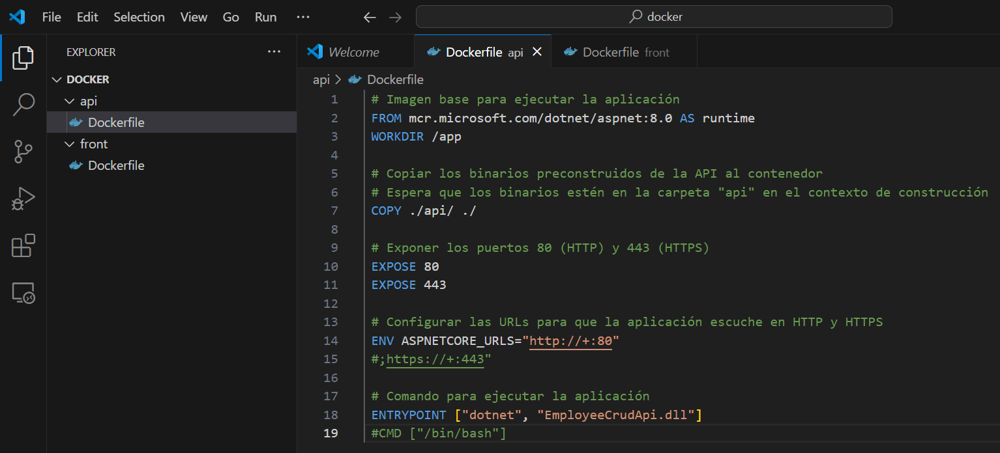
    
    - Crear un recurso ACR en Azure Portal
    
    - Modificar nuestro pipeline en la etapa de Build y Test
    
    
    - En caso de no contar en nuestro proyecto con una ServiceConnection a Azure Portal para el manejo de recursos, agregar una service connection a Azure Resource Manager
    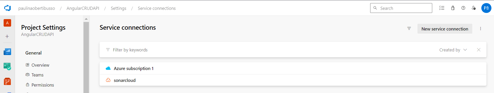
    - Agregar a nuestro pipeline variables
    
    - Agregar a nuestro pipeline una nueva etapa que dependa de nuestra etapa de Build y Test
    
    - Ejecutar el pipeline y en Azure Portal acceder a la opción Repositorios de nuestro recurso Azure Container Registry. Verificar que exista una imagen con el nombre especificado en la variable backImageName asignada en nuestro pipeline
    
    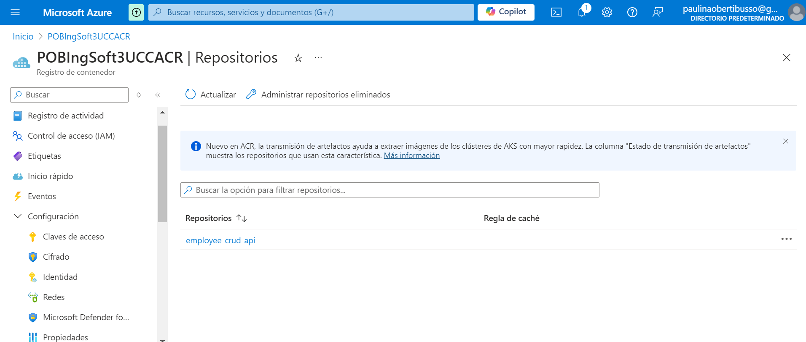
    - Agregar a nuestro pipeline una nueva etapa que dependa de nuestra etapa de Construcción de Imagenes Docker y subida a ACR
    
    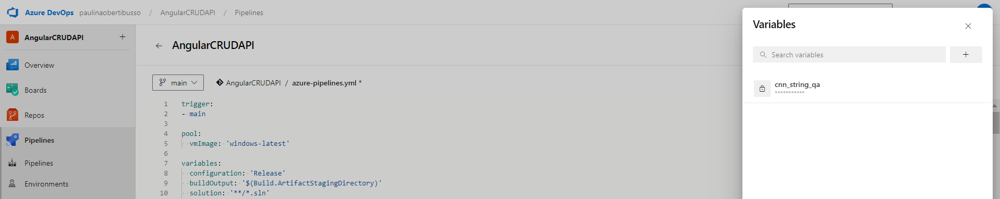
    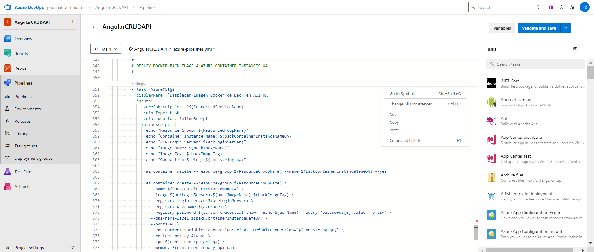
    Configuramos el archivo Program.cs para que utilice la variable configurada
    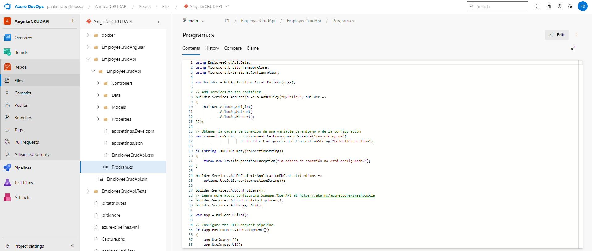
    Otorgamos permisos desde Azure CLI
    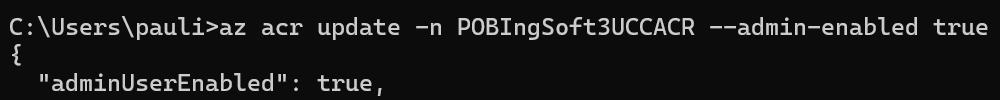
    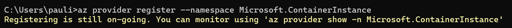
    - Ejecutar el pipeline y en Azure Portal acceder al recurso de Azure Container Instances creado. Copiar la url del contenedor y navegarlo desde browser. Verificar que traiga datos.
    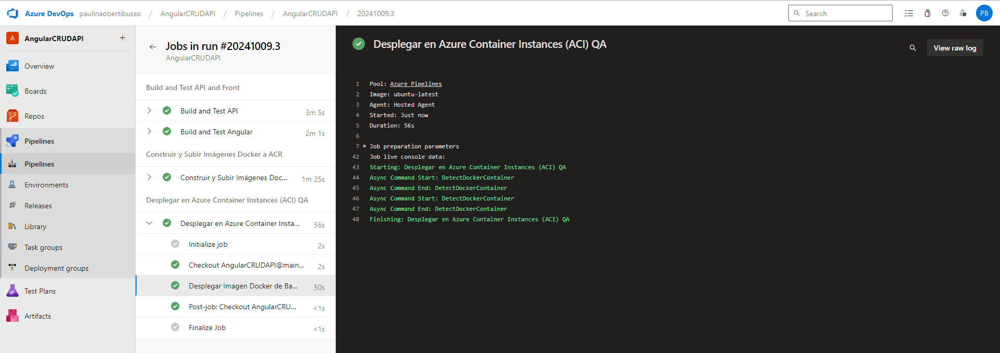
    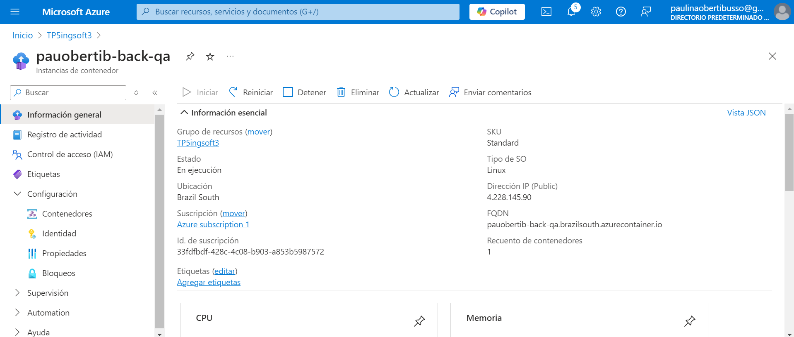
    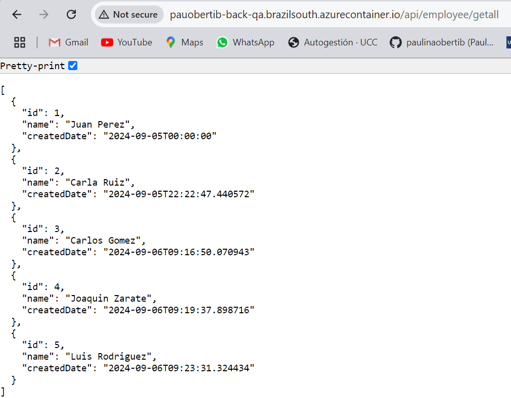

# Desafios
1. Agregar tareas para generar imagen Docker de Front
    - 
    - 
    - 
    - 
2. Agregar tareas para generar en Azure Container Instances un contenedor de imagen Docker de Front.
    - Creamos la variable
    - 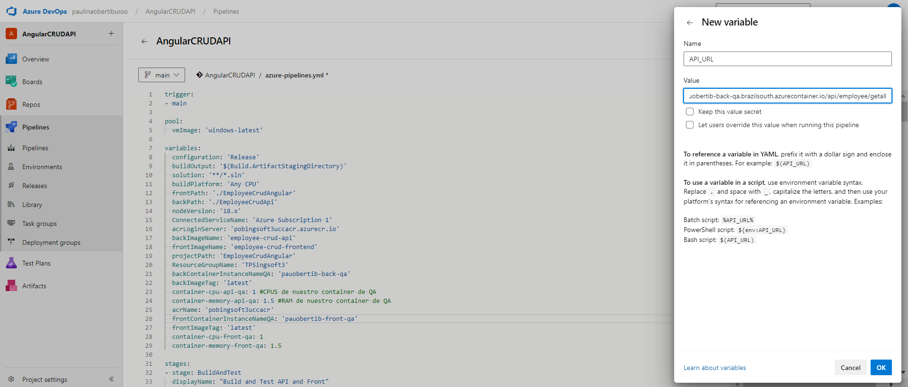
    - Instalamos lo necesario
    - 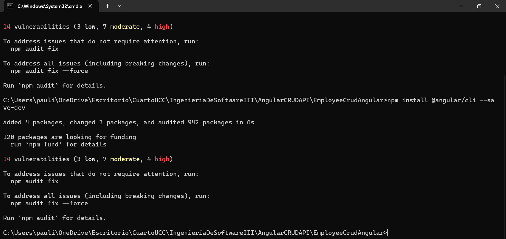
    - Modificamos el código del FrontEnd
    - 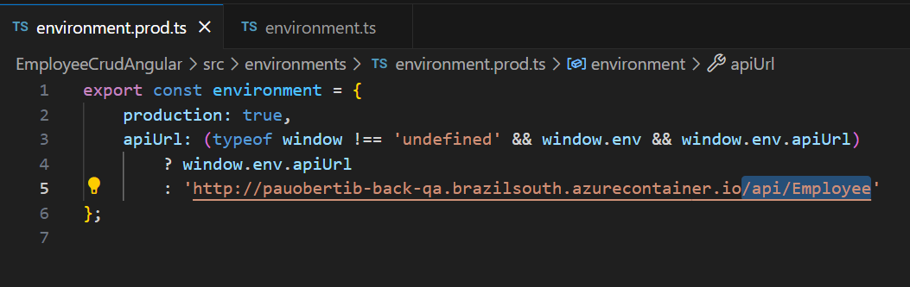
    - 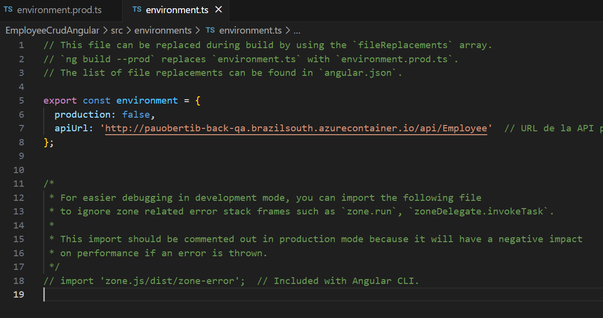
    - 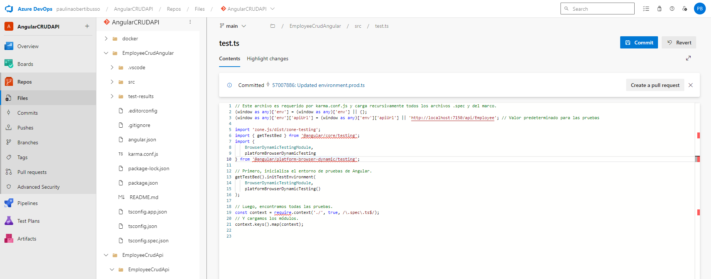
    - 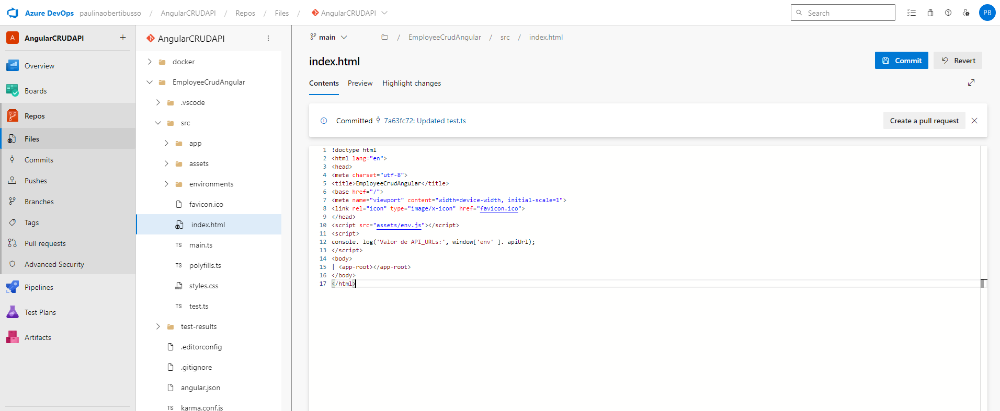
    - 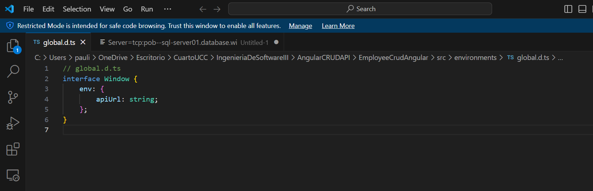
    - Modificamos el pipeline
    - 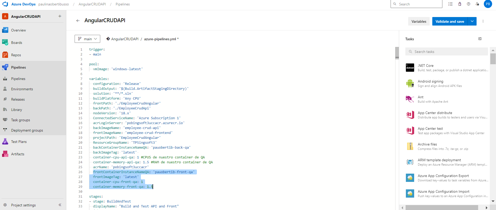
    - 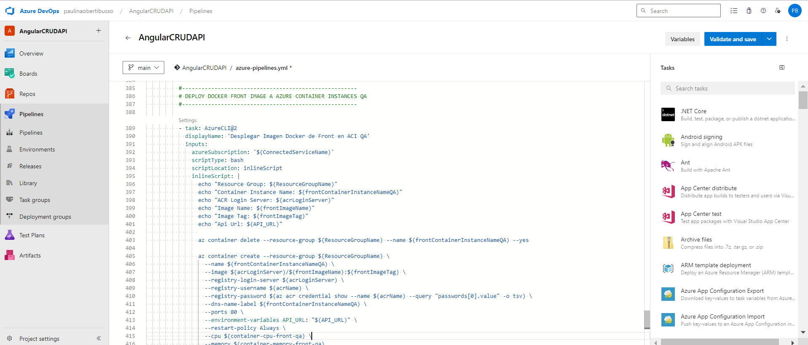
    - Corremos el pipeline
    - 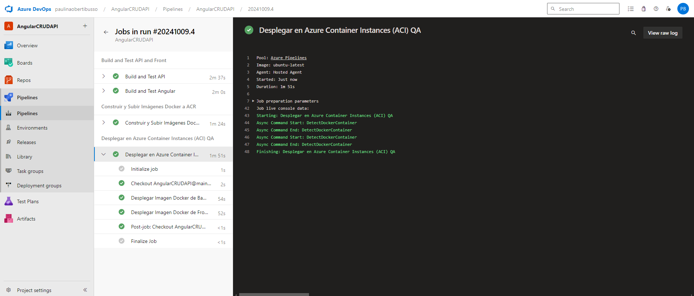
    - Comprobamos
    - 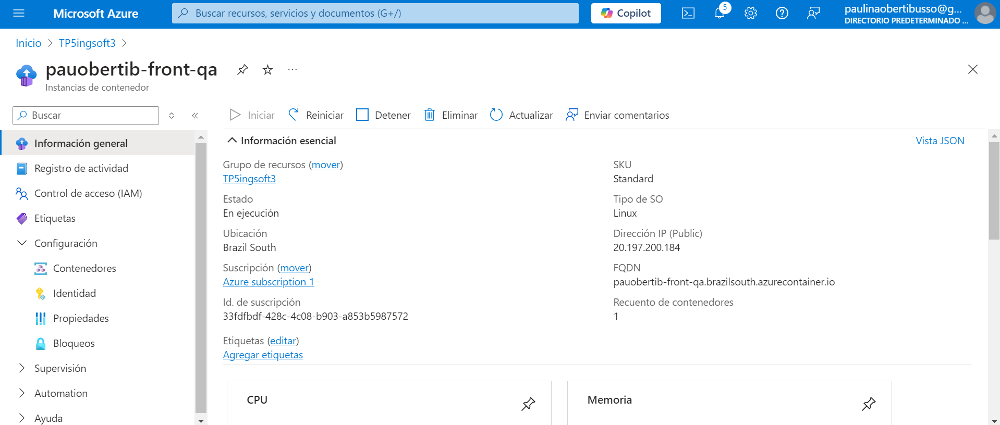
    - 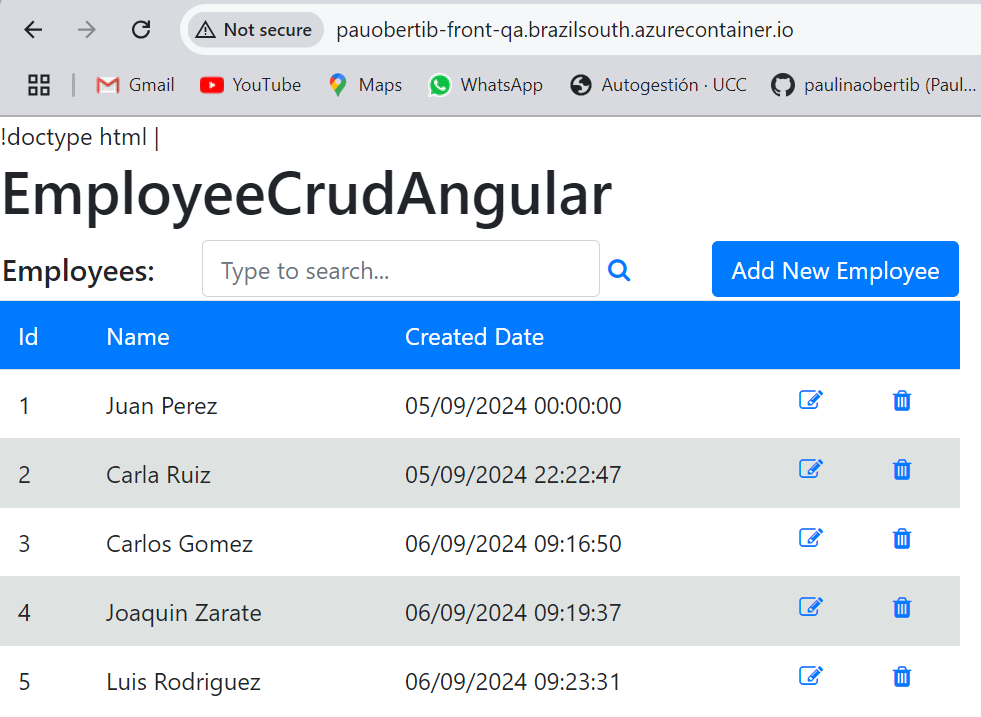
3. Agregar tareas para correr pruebas de integración en el entorno de QA de Back y Front creado en ACI.

4. Agregar etapa que dependa de la etapa de Deploy en ACI QA y genere contenedores en ACI para entorno de PROD.
