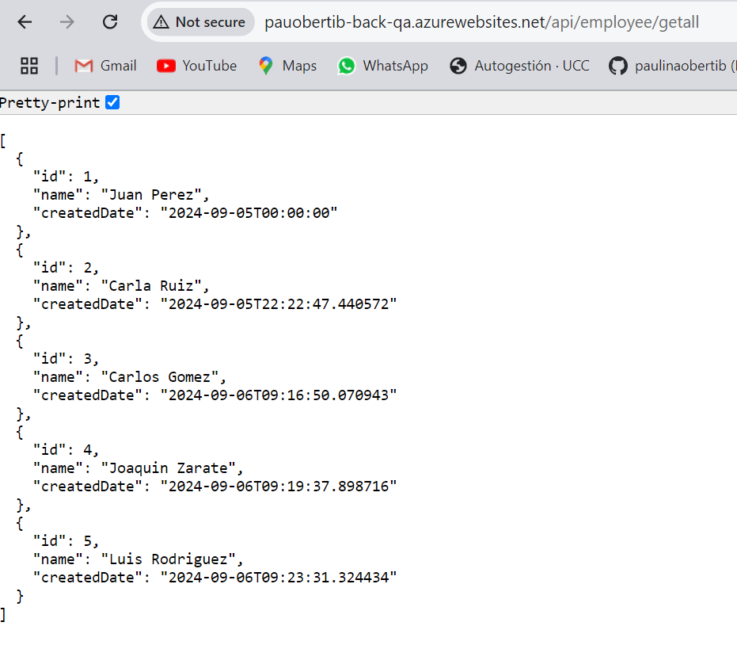

## Actividad
1. Modificar nuestro pipeline para incluir el deploy en QA y PROD de Imagenes Docker en Servicio Azure App Services con Soporte para Contenedores

## Desafios
1. Agregar tareas para generar Front en Azure App Service con Soporte para Contenedores

2. Agregar variables necesarias para el funcionamiento de la nueva etapa considerando que debe haber 2 entornos QA y PROD para Back y Front.

3. Agregar tareas para correr pruebas de integración en el entorno de QA de Back y Front creado en Azure App Services con Soporte para Contenedores.

4. Agregar etapa que dependa de la etapa de Deploy en QA que genere un entorno de PROD.

5. Entregar un pipeline que incluya:
- Etapa Construcción y Pruebas Unitarias y Code Coverage Back y Front
- Construcción de Imágenes Docker y subida a ACR
- Deploy Back y Front en QA con pruebas de integración para Azure Web Apps
- Deploy Back y Front en QA con pruebas de integración para ACI
- Deploy Back y Front en QA con pruebas de integración para Azure Web Apps con Soporte para contenedores
- Aprobación manual de QA para los puntos C,D,E
- Deploy Back y Front en PROD para Azure Web Apps
- Deploy Back y Front en PROD para ACI
- Deploy Back y Front en PROD para Azure Web Apps con Soporte para contenedores
**El pipeline se encuentra en mi cuenta de AzureDevOps en el proyecto AngularCRUDAPI, el id es c5165829**

